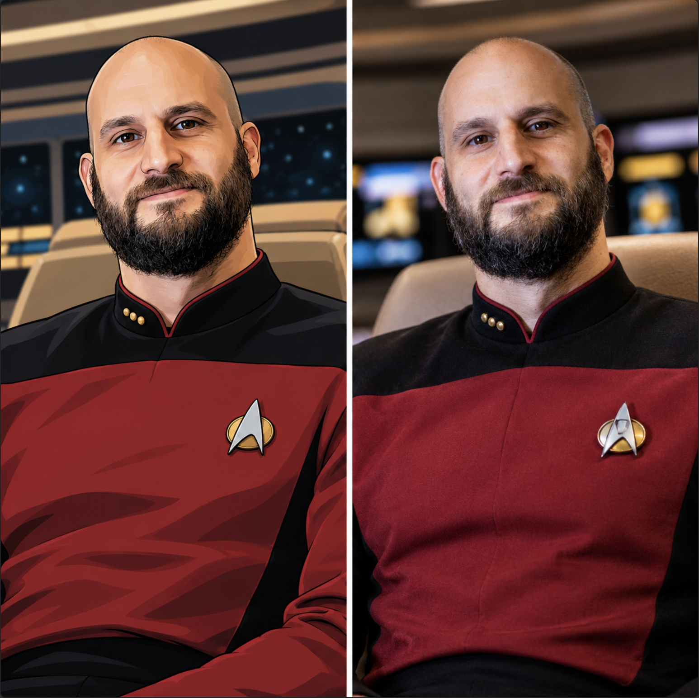
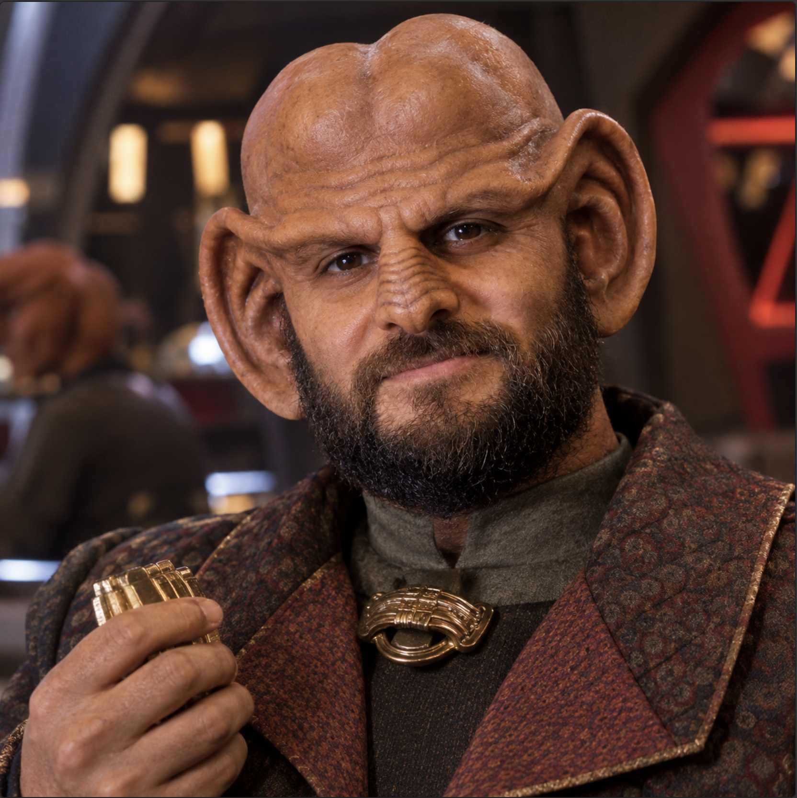
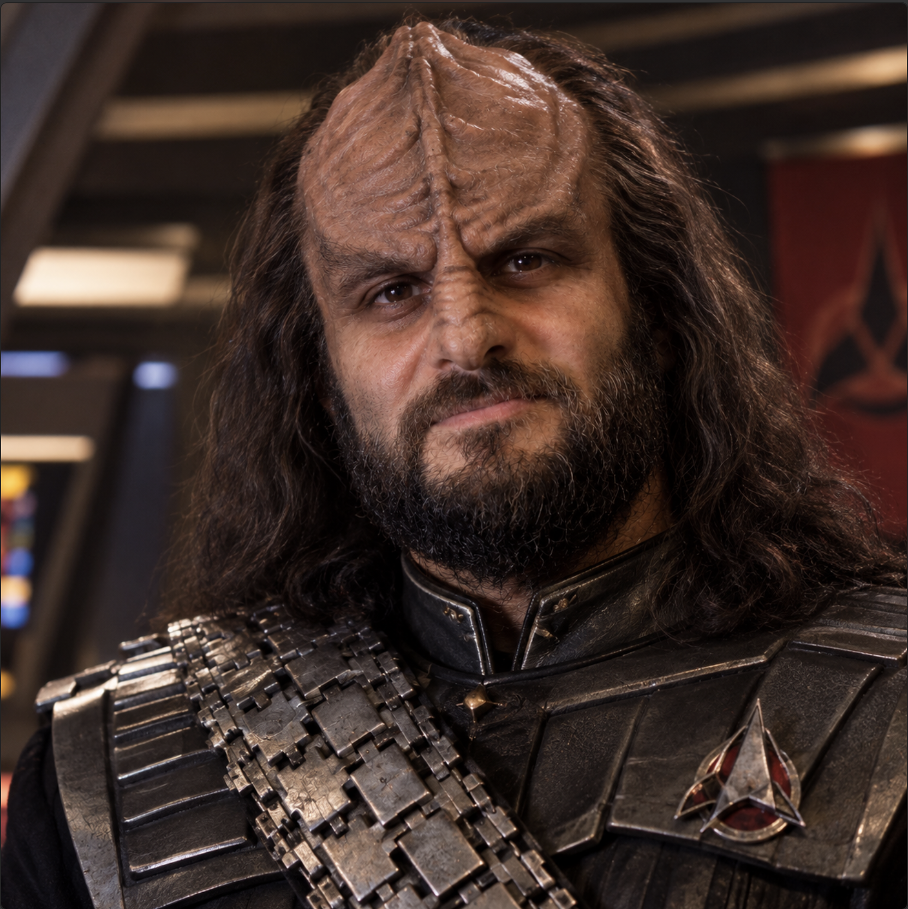

# SFC Voice Commander



Proyecto para controlar por voz **Star Fleet Command (1) / Star Fleet Command II**
(juego de Windows 10, i7/16GB), simulando ser el capitán: "Incrementar velocidad a
media máquina" → el sistema traduce la orden a pulsaciones de teclado reales
(`S` para acelerar) hasta alcanzar el valor deseado. Se contemplan dos escenarios
de despliegue (una sola máquina vs. dos máquinas en red) — ver sección 1.

Este documento describe la teoría/arquitectura general del proyecto. **El código ya
existe y las Fases 0, 1 y 2 del plan (más abajo) están completas y validadas en la
máquina Windows real** — ver `scripts/` para la implementación y la sección
"Estado actual" más abajo para un resumen. Ver `docs/hotkeys_sfc2.md` para la lista
completa de hotkeys extraída de los manuales oficiales de la Gold Edition
(`SFCfullMan.pdf`, `Supplemental Manual.pdf`, `SFCquick.pdf`).
Ver `ROADMAP.md` para la bitácora de avance detallada: checklist por fase, qué se
probó, qué funcionó y qué falta — ese es el documento vivo que se va actualizando a
medida que probamos cosas en la máquina Windows; este README se actualiza en base a
esa bitácora cuando el estado general del proyecto cambia.

## 0. Estado actual (resumen — ver `ROADMAP.md` para el detalle completo)

- **Fase 0 (validación de input) — ✅ completa.** El juego identificado es
  **Star Trek: Starfleet Command Gold Edition** (SFC1 + expansiones). Corre en
  pantalla completa exclusiva; se resolvió el modo ventana con **DxWnd** (no
  alcanzó con `SFC.INI` solo). Confirmado que `pydirectinput` sí logra que el
  juego reaccione a teclas simuladas, **corriendo la consola de Python como
  Administrador** (imprescindible, si no el input no llega por UIPI de Windows).
  Script: `scripts/fase0_test_key.py`.
- **Fase 1 (comandos por texto, sin voz) — ✅ completa.** Parser de reglas
  completo en `scripts/fase1_text_commands.py`: velocidad relativa, alerta
  roja/amarilla, disparo, escudos, ECM/ECCM, cámaras, selección/seguimiento de
  objetivos, comando de ayuda (lista todos los comandos disponibles) y
  **combos** (una frase → varias teclas en secuencia, ej. "ataquen con todo",
  "aléjense a máxima velocidad"). Reenfoque automático de la ventana del juego
  tras cada acción.
- **Fase 2 (voz) — ✅ implementada, pendiente de más pruebas en vivo con
  micrófono real.** `scripts/fase2_voice_commands.py` agrega captura de audio
  por **push-to-talk** (tecla `F12` por defecto) + STT, reusando el mismo
  parser/ejecutor de la Fase 1. Soporta dos backends de STT intercambiables:
  - `openai` (`scripts/stt_openai.py`, API de transcripción de OpenAI con el
    modelo `gpt-4o-mini-transcribe` + vocabulary biasing vía parámetro
    `prompt`, siguiendo la guía oficial de Speech-to-Text) — backend por
    defecto actual, requiere internet + `OPENAI_API_KEY`.
  - `local` (`faster-whisper` en CPU) — sin internet ni costo.
- **Fase 4 (LLM como fallback) — adelantada e implementada,** aunque en el plan
  original era opcional/posterior: `scripts/catalogo_comandos.py` genera
  dinámicamente el catálogo de comandos disponibles a partir de los mismos
  diccionarios del parser de reglas (para que nunca queden desincronizados), y
  `scripts/llm_fallback.py` lo usa para interpretar frases que el parser no
  reconoce, con dos backends: Ollama local (JSON libre) u **OpenAI con function
  calling nativo** (`tools=[...]`, más confiable que pedir JSON libre).
- **Fase 3 (velocidad relativa precisa vía OCR/calibración) y Fase 6 (giro por
  rumbo) — aún no iniciadas.**
- Ver `ROADMAP.md` para el detalle de cada checklist, incluyendo la Fase 7
  (evaluación de feedback externo sobre la arquitectura de IA, sin cambios de
  código resultantes).

## 1. Escenarios de despliegue considerados

El juego corre siempre en Windows 10 (i7, 16GB RAM — hardware de sobra para correr
STT local sin problema). Hay dos escenarios posibles según dónde esté el micrófono;
se documentan ambos, pero **el Escenario A (una sola máquina) es el recomendado**
si se consigue un micrófono para la PC Windows, porque simplifica mucho el proyecto.
El Escenario B queda documentado como respaldo/alternativa por si en algún momento
no se puede usar mic en esa máquina, o si se quiere separar la carga de cómputo.

### Escenario A — Una sola máquina (recomendado)
Todo el pipeline (mic → STT → parser → teclado) corre **en la misma PC Windows**
donde está el juego. No hace falta red, sockets, ni un segundo equipo.

- Ventajas: arquitectura mucho más simple (un solo proceso Python), sin latencia de
  red para el audio (que es la parte más sensible a delay), sin necesidad de manejar
  conexión/desconexión entre máquinas, menos piezas que puedan fallar.
- Requisito: conseguir un micrófono para la Windows (headset USB simple alcanza).
- El hardware (i7 + 16GB) es más que suficiente para correr `faster-whisper` (modelo
  `small`/`medium`) en CPU con buena velocidad, en paralelo al juego.
- Internet solo se usaría opcionalmente si en el futuro se prefiere un STT o LLM
  cloud en vez de local (por ejemplo, si la precisión del modelo local en español no
  convence). No es un requisito de la arquitectura, es una mejora opcional.



### Escenario B — Dos máquinas (respaldo, por si no se consigue mic en la Windows)
El juego corre en la PC Windows, pero la captura de voz y/o la interpretación ocurren
en otra máquina (ej. tu Mac), comunicándose por la red casera (ambas máquinas están
en la misma LAN, con lo cual la latencia debería ser baja, pero igual hay que sumar
el tiempo de ida y vuelta más la posible falla de conexión).

1. **"Cliente" en la máquina Windows del juego**: un pequeño script que recibe
   comandos por red y los traduce en pulsaciones de teclado reales sobre la ventana
   del juego (inyección de input a nivel de OS, no solo al proceso).
2. **"Cerebro" (agente de voz)**: corre en la otra máquina (Mac/servidor),
   escuchando el micrófono, transcribiendo, interpretando la orden y decidiendo qué
   teclas mandar y cuántas veces.

Ambas partes se comunican por una API simple (HTTP local o WebSocket) para desacoplar
reconocimiento de voz / interpretación (que podría vivir en una máquina con más
capacidad de cómputo específica, ej. GPU) de la inyección de teclado (que tiene que
vivir sí o sí en la Windows, cerca del juego).

## 2. Componentes propuestos

### 2.1 Voice capture + STT (Speech-to-Text)
- Captura continua de audio con activación por palabra clave tipo "Capitán" o
  push-to-talk (más confiable, menos falsos positivos).
- Opciones de STT:
  - **Local/offline**: `whisper.cpp` o `faster-whisper` (funciona bien en CPU,
    sin depender de internet, importante si esto corre "en la otra máquina" sin
    conectividad garantizada).
  - **Cloud**: Whisper API de OpenAI, Google Speech-to-Text, Azure Speech. Más
    preciso y rápido pero requiere internet y tiene costo por uso.
- Recomendación inicial: **faster-whisper local**, modelo `small` o `medium` en
  español, corriendo en la máquina que vos elijas (no necesariamente la del juego).

### 2.2 NLU / Interpretación de comandos (el "traductor" capitán → acción)
Acá hay dos enfoques, no excluyentes:

**A) Enfoque determinístico (reglas + gramática) — recomendado para empezar**
- Un parser de comandos con expresiones regulares / gramática simple orientada a
  dominio: verbos (incrementar/reducir/mantener), objetos (velocidad, escudos,
  energía, alerta), y magnitudes (cuarto de máquina, media máquina, máxima,
  numérico "70%", etc.)
- Ventajas: rápido, predecible, sin costo de tokens/LLM, funciona offline,
  fácil de debuggear y de extender agregando sinónimos.
- Ejemplo de mapeo:
  - "incrementar velocidad a media máquina" → `set_speed(target_pct=50)`
  - "alerta roja" → `press("R")`
  - "fuego a discreción" / "disparar" → `press("Z")`
  - "escudos al máximo" → `press("K")` (abrir panel) + lógica de refuerzo

**B) Enfoque con LLM (function calling) — para lenguaje más libre**
- Mandar la transcripción a un LLM (local via Ollama, o API) con un *system prompt*
  que describa el rol ("sos el sistema de control de una nave de Star Trek: Starfleet
  Command...") y una lista de "herramientas" disponibles (funciones) que el LLM puede
  invocar: `set_speed(pct)`, `red_alert()`, `fire_weapons()`, `set_shields(quadrant, pct)`, etc.
- Ventajas: entiende variantes de lenguaje natural sin que vos tengas que anticipar
  cada frase ("aumentá un poco la velocidad", "llevala a la mitad", "más rápido").
- Desventajas: latencia mayor, requiere definir bien las funciones/schema, y si es
  cloud, requiere internet + tiene costo.
- Recomendación: usar function calling **encima** del parser determinístico como
  fallback, no en lugar de él — el parser cubre el 80% de comandos típicos con
  latencia mínima, y el LLM entra solo cuando el parser no reconoce el patrón.

### 2.3 Detalle del parser por reglas (sin ningún modelo de por medio)

Importante: el parser de reglas **no necesita ningún modelo de IA**, solo texto y
lógica de programación normal. Se compone de:

1. **Normalización** del texto transcripto (minúsculas, sin tildes, sin espacios extra).
2. **Diccionario de sinónimos** por concepto (velocidad, alerta, disparo, etc.), para
   no depender de una frase exacta.
3. **Reglas/regex** simples que buscan esas palabras clave en el texto y arman la
   acción estructurada correspondiente.



Ejemplo de implementación mínima:

```python
import re, unicodedata

SPEED_WORDS = {
    "cuarto de maquina": 25, "un cuarto": 25,
    "media maquina": 50, "mitad": 50,
    "tres cuartos": 75,
    "toda maquina": 100, "maxima": 100, "avante toda": 100,
    "alto total": 0, "parar": 0, "detener": 0,
}

def normalizar(txt):
    txt = txt.lower().strip()
    return ''.join(c for c in unicodedata.normalize('NFD', txt)
                   if unicodedata.category(c) != 'Mn')  # saca tildes

def parsear_comando(texto):
    t = normalizar(texto)

    for frase, pct in SPEED_WORDS.items():
        if frase in t:
            return {"action": "set_speed", "pct": pct}

    m = re.search(r'(\d+)\s*(por ciento|%)', t)
    if m and 'velocidad' in t:
        return {"action": "set_speed", "pct": int(m.group(1))}

    if 'alerta roja' in t:
        return {"action": "key", "key": "R"}
    if 'alerta amarilla' in t:
        return {"action": "key", "key": "Y"}
    if any(w in t for w in ['disparar', 'fuego', 'ataquen']):
        return {"action": "key", "key": "Z"}

    return {"action": "unknown", "raw": texto}
```

Limitación real de este enfoque: solo reconoce las frases/sinónimos que se hayan
anticipado en el diccionario. Como el vocabulario de una nave (velocidad, alerta,
disparo, escudos) es acotado y bastante estandarizado en el imaginario de Star Trek
("media máquina", "alerta roja", "fuego a discreción"), en la práctica un buen
diccionario de sinónimos cubre la gran mayoría de los comandos reales sin necesitar
ningún modelo de lenguaje.

### 2.4 ¿Qué mejora tener un LLM local, y cuánto pesa?

Es importante no confundir el STT (Whisper) con el LLM (Ollama, etc.) — son cosas
distintas y cumplen roles distintos:

- **STT (Whisper)**: convierte audio → texto. Esto **sí es necesario siempre** que
  se use voz, con o sin LLM — alguien tiene que transcribir lo que decís. Whisper de
  por sí ya es un modelo, pero es chico y liviano (ver tabla abajo).
- **LLM local**: es **opcional**. Solo agrega valor cuando el parser de reglas no
  reconoce una frase (lenguaje más libre/coloquial, ej. "che, aceleremos bastante,
  como al 80%"). No reemplaza al STT, se usa *después* de él, solo como fallback.

**Tamaños de modelos Whisper (necesario siempre que haya voz):**

| Modelo | Tamaño en disco | RAM aprox. | Precisión |
|---|---|---|---|
| tiny | ~75 MB | ~1 GB | básica, rápida |
| base | ~145 MB | ~1 GB | ok |
| small | ~480 MB | ~2 GB | buena, recomendado |
| medium | ~1.5 GB | ~5 GB | muy buena |
| large-v3 | ~3 GB | ~10 GB | excelente, más lento en CPU |

Con el i7/16GB de la Windows, `small` o `medium` corren perfectamente en CPU (pocos
segundos por frase corta), sin necesitar GPU.

**Tamaños de LLM local vía Ollama (opcional, solo para fallback de lenguaje libre):**

| Modelo | Tamaño en disco (cuantizado) | RAM aprox. necesaria |
|---|---|---|
| Llama 3.2 1B | ~1.3 GB | ~2-3 GB |
| Llama 3.2 3B | ~2 GB | ~4-5 GB |
| Phi-3 mini (3.8B) | ~2.3 GB | ~5 GB |
| Mistral 7B | ~4.1 GB | ~8 GB |
| Llama 3.1 8B | ~4.7 GB | ~8-10 GB |

Con 16GB de RAM se puede correr sin problema hasta un modelo de 7-8B parámetros
cuantizado en CPU (más lento que con GPU, pero utilizable). Para esta tarea puntual
(mapear una frase corta a una función con pocos parámetros posibles) ni hace falta
algo grande: un modelo chico como Llama 3.2 3B o Phi-3 mini (~2GB) alcanza de sobra.

**Recomendación:** arrancar solo con Whisper + parser de reglas (Fases 1-2 del plan),
sin instalar ningún LLM. Agregar un LLM local recién si en la práctica el parser se
queda corto muy seguido — en ese caso un modelo chico (~2GB) es más que suficiente y
el hardware disponible lo soporta sin drama.

### 2.5 Traductor de "intención" a "secuencia de teclas"
Esta es la parte más interesante y específica del juego. No alcanza con "apretar S":
para llegar a una velocidad relativa (ej: 50%) hace falta:

1. **Conocer la velocidad máxima de la nave actual** (varía según clase de nave:
   fragata, crucero, dreadnought, etc. — no hay un valor fijo en el manual).
2. **Saber la velocidad actual/deseada** para calcular cuántos pasos de `S`/`A` faltan.
3. **Determinar el tamaño del paso** por cada pulsación (el manual no lo especifica
   numéricamente — hay que medirlo empíricamente jugando y observando el HUD, o
   asumir que cada tecla ajusta el "Desired Speed" un incremento fijo que se puede
   calibrar).

Esto requiere **feedback visual del juego**, porque el control por teclado es "ciego"
(no hay una API oficial que exponga el estado de la nave). Opciones para obtener el
feedback:

- **OCR sobre el HUD**: capturar la pantalla del juego (share/streaming de la otra
  máquina, o un agente liviano en Windows que tome un screenshot de la región de la
  barra de interfaz) y leer con OCR (Tesseract) los indicadores "Current Speed" /
  "Desired Speed/Speed Slider" (elementos 12 y 13 de la interface bar, según el
  manual quickstart). Es la opción más robusta para saber cuándo dejar de apretar S.
- **Enfoque simplificado (sin OCR) para el MVP**: en vez de tratar de fijar un %
  exacto, definir "niveles" fijos de velocidad como *cantidad de pulsaciones desde
  cero* (asumiendo que siempre partimos de detener la nave con varios `A` seguidos
  hasta el piso, y de ahí contamos N pulsaciones de `S` para llegar a "un cuarto",
  "media", "toda máquina"). Esto es menos preciso pero no depende de leer pantalla,
  y es mucho más simple de implementar primero.
- Términos náuticos como en Star Trek: "un cuarto de máquina" (25%), "media máquina"
  (50%), "tres cuartos de máquina" (75%), "toda máquina avante" (100%), "alto total"
  (0%, con `A` repetido o "Emergency Deceleration" en Numpad 0 para frenado brusco).

### 2.4 Inyección de teclado en Windows
- El "cliente" en la máquina del juego necesita simular pulsaciones de teclado
  reales dirigidas a la ventana del juego (no solo eventos de proceso, sino a nivel
  de sistema, ya que muchos juegos DirectX ignoran mensajes de ventana estándar).
- Opciones típicas en Windows:
  - `pyautogui` (Python) — simple pero a veces no funciona con juegos DirectInput/
    fullscreen exclusivo.
  - `pydirectinput` — pensado específicamente para simular input compatible con
    juegos que usan DirectInput (mejor candidato que pyautogui para este caso).
  - `SendInput` de la API de Win32 (usada internamente por pydirectinput) — la
    opción más confiable a bajo nivel.
  - AutoHotkey (si se prefiere no usar Python en la parte Windows) recibiendo
    comandos por un socket/archivo y traduciéndolos a `Send`.
- Hay que probar en el juego real cuál mecanismo efectivamente llega, porque juegos
  viejos (2000-2001, DirectX 7/8) pueden comportarse distinto a lo esperado por estas
  librerías modernas.

## 3. Arquitectura propuesta (a validar por fases)

### 3.A Escenario A — Una sola máquina (recomendado)

```
[PC Windows — i7 / 16GB — juego + agente de voz, todo en un solo proceso]

Micrófono ──▶ Captura de audio
                    │
                    ▼
             STT (faster-whisper local)
                    │  texto transcripto
                    ▼
             Parser de comandos (reglas) ──fallback opcional──▶ LLM
                    │                                  (local Ollama o cloud vía internet)
                    ▼  acción estructurada (ej: {"action":"set_speed","pct":50})
             Traductor acción → teclas
             (+ conteo de pasos / OCR opcional)
                    │
                    ▼
             pydirectinput / SendInput
                    │
                    ▼
             Ventana del juego (SFC/SFC2)
```

Sin red, sin sockets, sin segunda máquina: todo el flujo vive en el mismo script/
proceso Python corriendo en la Windows.

### 3.B Escenario B — Dos máquinas (respaldo)

```
[Mac / equipo con micrófono]                [PC Windows con el juego]
   Captura de audio
        │
        ▼
   STT (faster-whisper local)
        │  texto transcripto
        ▼
   Parser de comandos (reglas)  ──fallback──▶ LLM function calling
        │  acción estructurada (ej: {"action":"set_speed","pct":50})
        ▼
   Cliente de red (WebSocket/HTTP) ────────────▶  Servidor liviano en Windows
                                                       │
                                                       ▼
                                                 Traductor acción → teclas
                                                 (+ conteo de pasos / OCR opcional)
                                                       │
                                                       ▼
                                                 pydirectinput / SendInput
                                                       │
                                                       ▼
                                                  Ventana del juego (SFC/SFC2)
```

## 4. Plan de fases (estado real — ver `ROADMAP.md` para el detalle día a día)

El plan es el mismo conceptualmente para ambos escenarios; lo único que cambia es
si la Fase 1/2 incluyen o no la parte de red (cliente/servidor). En la práctica se
implementó directo el **Escenario A (una sola máquina)**, ya que se consiguió
micrófono para la Windows y no hizo falta el Escenario B.

1. **Fase 0 – Validación de input ✅ completa**: script mínimo en la PC Windows que,
   al recibir una tecla por parámetro de línea de comandos, la simula contra el
   juego. Confirmado que `pydirectinput` funciona contra el juego real (corriendo
   como Administrador). Script: `scripts/fase0_test_key.py`.
2. **Fase 1 – Comandos por texto (sin voz) ✅ completa**: `scripts/fase1_text_commands.py`
   recibe comandos en texto plano ("velocidad media") por consola y los traduce con
   el parser de reglas, incluyendo combos y comando de ayuda. Esto validó el mapeo
   "intención → teclas" sin la complejidad de STT ni de red.
   - No se necesitó el Escenario B, así que no se implementó el mini-servidor/cliente
     por red.
3. **Fase 2 – Voz ✅ implementada** (pendiente más pruebas en vivo con micrófono
   real): `scripts/fase2_voice_commands.py` agrega captura de micrófono (push-to-talk)
   + STT (OpenAI o `faster-whisper` local, intercambiable), alimentando el mismo
   parser de la Fase 1.
4. **Fase 3 – Velocidad relativa precisa** *(pendiente, no iniciada)*: agregar OCR
   del HUD (o calibración manual de pasos) para que "media máquina" sea preciso
   según la nave actual.
5. **Fase 4 – LLM function calling ✅ implementada** (adelantada respecto al plan
   original, que la marcaba opcional/posterior): `scripts/llm_fallback.py` +
   `scripts/catalogo_comandos.py` cubren como fallback los comandos que el parser
   de reglas no reconoce, para lenguaje más natural/libre. Soporta Ollama local y
   OpenAI (function calling nativo).
6. **Fase 5 – Más comandos ✅ completa**: escudos, alerta roja/amarilla, disparo,
   ECM/ECCM, cámaras, selección/seguimiento de objetivos, etc., ya cubiertos en
   `scripts/fase1_text_commands.py` reusando la lista completa de
   `docs/hotkeys_sfc2.md`.
7. **Fase 6 – Giro por rumbo** *(evaluada, no implementada)*: girar la nave un
   ángulo determinado por voz vía cálculo trigonométrico + click en la vista
   táctica. Ver `ROADMAP.md` para el detalle de las opciones consideradas.
8. **Fase 7 – Feedback externo sobre arquitectura de IA** *(evaluada, sin cambios
   de código)*: se analizó feedback de un tercero sobre el enfoque de LLM/STT
   usado; queda documentado en `ROADMAP.md` qué se adoptó (nada nuevo, ya estaba
   cubierto) y qué se descartó y por qué.

## 5. Preguntas abiertas / decisiones pendientes

Ya resueltas (dejadas acá con su respuesta, a modo de historial):
- ✅ ¿Se consigue el micrófono para la Windows? → Sí, se consiguió; el proyecto usa
  el Escenario A (una sola máquina).
- ✅ ¿SFC1 o SFC2 corriendo hoy en esa máquina? → **SFC1**: Star Trek: Starfleet
  Command Gold Edition (con expansiones Empires at War / Neutral Zone integradas).
- ✅ ¿El juego corre en ventana o pantalla completa exclusiva? → Pantalla completa
  exclusiva de origen; se fuerza modo ventana con **DxWnd** (ver `ROADMAP.md`).

Todavía pendientes:
- ¿Vale la pena arrancar directo con OCR del HUD, o seguir con el enfoque
  simplificado por conteo de pulsaciones para la Fase 3 (velocidad relativa
  precisa)? Aún no iniciada.
- Fase 6 (giro por rumbo): ¿ir directo con la Opción B (OCR del rumbo real) o
  empezar con la Opción A (asumir cámara centrada + trigonometría simple)? Ver
  `ROADMAP.md` sección Fase 6.
